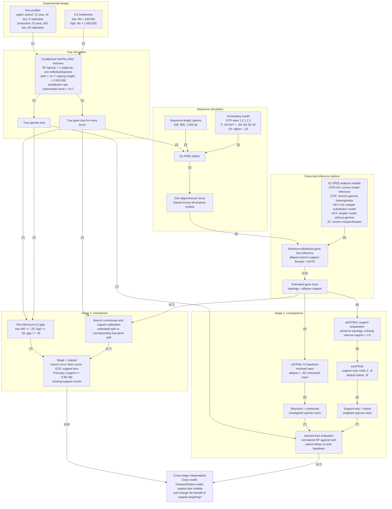

# Experimental pipeline and tested options

This figure summarizes the implemented workflow for testing how gene-tree model
misspecification changes branch-support reliability and the downstream
difference between unweighted ASTRAL and support-weighted wASTRAL. Every edge
contains at least one bracketed reference number; the numbers map to the papers
listed immediately below the figure.

## Reference papers

1. Mallo, D., Martins, L. de O., & Posada, D. (2016). **SimPhy:
   Phylogenomic Simulation of Gene, Locus, and Species Trees.** *Systematic
   Biology, 65*(2), 334–344. https://doi.org/10.1093/sysbio/syv082

2. Ly-Trong, N., Naser-Khdour, S., Lanfear, R., & Minh, B. Q. (2022).
   **AliSim: A Fast and Versatile Phylogenetic Sequence Simulator for the
   Genomic Era.** *Molecular Biology and Evolution, 39*(5), msac092.
   https://doi.org/10.1093/molbev/msac092

3. Nguyen, L.-T., Schmidt, H. A., von Haeseler, A., & Minh, B. Q. (2015).
   **IQ-TREE: A Fast and Effective Stochastic Algorithm for Estimating
   Maximum-Likelihood Phylogenies.** *Molecular Biology and Evolution, 32*(1),
   268–274. https://doi.org/10.1093/molbev/msu300

4. Anisimova, M., Gil, M., Dufayard, J.-F., Dessimoz, C., & Gascuel, O.
   (2011). **Survey of Branch Support Methods Demonstrates Accuracy, Power,
   and Robustness of Fast Likelihood-based Approximation Schemes.**
   *Systematic Biology, 60*(5), 685–699.
   https://doi.org/10.1093/sysbio/syr041

5. Mirarab, S., Reaz, R., Bayzid, M. S., Zimmermann, T., Swenson, M. S., &
   Warnow, T. (2014). **ASTRAL: Genome-scale Coalescent-based Species Tree
   Estimation.** *Bioinformatics, 30*(17), i541–i548.
   https://doi.org/10.1093/bioinformatics/btu462

6. Zhang, C., & Mirarab, S. (2022). **Weighting by Gene Tree Uncertainty
   Improves Accuracy of Quartet-based Species Trees.** *Molecular Biology and
   Evolution, 39*(12), msac215. https://doi.org/10.1093/molbev/msac215

7. Robinson, D. F., & Foulds, L. R. (1981). **Comparison of Phylogenetic
   Trees.** *Mathematical Biosciences, 53*(1–2), 131–147.
   https://doi.org/10.1016/0025-5564(81)90043-2

## Implemented comparison grid

The same alignment for a locus is reused across all five IQ-TREE analysis
models. Each resulting estimated-gene-tree set is sent to resolved and
0.90-aBayes-contracted ASTRAL-IV, support-only wASTRAL, and default hybrid
wASTRAL. This paired design isolates the effect of support weighting within
each combination of ILS level, sequence length, replicate, and analysis model.

Each Stage 2 weighted-minus-baseline delta is interpreted as follows:

- `delta < 0`: support weighting helped.
- `delta = 0`: support weighting made no topological difference.
- `delta > 0`: support weighting hurt.

The paper-subset profile shown in the figure is the reduced grid exercised in
`work/paper_subset_10x2`. The production profile records the full defaults in
the pipeline; it should not be described as completed until all expected
outputs have been generated and checked.
